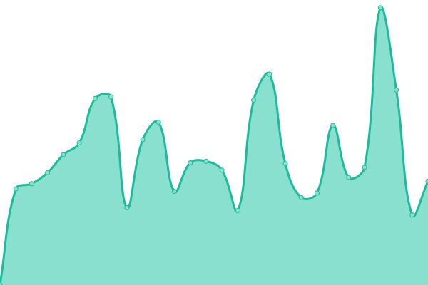

# [📈 Live Status](https://demo.upptime.js.org): <!--live status--> **🟩 All systems operational**

This repository contains the open-source uptime monitor and status page for [Paweł Cichowski](pcichowski.com), powered by [Upptime](https://github.com/upptime/upptime).

With [Upptime](https://upptime.js.org), you can get your own unlimited and free uptime monitor and status page, powered entirely by a GitHub repository. We use [Issues](https://github.com/pcichowski/esovisco-service-status/issues) as incident reports, [Actions](https://github.com/pcichowski/esovisco-service-status/actions) as uptime monitors, and [Pages](https://demo.upptime.js.org) for the status page.

<!--start: status pages-->
<!-- This summary is generated by Upptime (https://github.com/upptime/upptime) -->
<!-- Do not edit this manually, your changes will be overwritten -->
<!-- prettier-ignore -->
| URL | Status | History | Response Time | Uptime |
| --- | ------ | ------- | ------------- | ------ |
|  [MTM - Production API](https://vpn.mtm-sa.com.pl:8443/api/v1) | 🟩 Up | [mtm-production-api.yml](https://github.com/pcichowski/esovisco-service-status/commits/HEAD/history/mtm-production-api.yml) | 

 723ms
     
 | 

<a href="https://status.esovisco.com/history/mtm-production-api">100.00%</a>
    

|  [MTM - Staging API](https://mtm-api-test-ea36e1a51b7e.herokuapp.com/api/v1/) | 🟩 Up | [mtm-staging-api.yml](https://github.com/pcichowski/esovisco-service-status/commits/HEAD/history/mtm-staging-api.yml) | 

 442ms
     
 | 

<a href="https://status.esovisco.com/history/mtm-staging-api">100.00%</a>
    

|  [MTM Transport - API](https://en.wikipedia.org) | 🟩 Up | [mtm-transport-api.yml](https://github.com/pcichowski/esovisco-service-status/commits/HEAD/history/mtm-transport-api.yml) | 

 288ms
     
 | 

<a href="https://status.esovisco.com/history/mtm-transport-api">100.00%</a>
    

|  [J2G - Dashboard](https://jam2gether.esovisco.com/) | 🟩 Up | [j2-g-dashboard.yml](https://github.com/pcichowski/esovisco-service-status/commits/HEAD/history/j2-g-dashboard.yml) | 

 327ms
     
 | 

<a href="https://status.esovisco.com/history/j2-g-dashboard">96.39%</a>
    

|  [J2G - Cloud API](https://jam2gether-api.cloud.esovisco.com:3456/) | 🟩 Up | [j2-g-cloud-api.yml](https://github.com/pcichowski/esovisco-service-status/commits/HEAD/history/j2-g-cloud-api.yml) | 

 484ms
     
 | 

<a href="https://status.esovisco.com/history/j2-g-cloud-api">100.00%</a>
    

|  [Esovisco - Website](https://esovisco.com) | 🟩 Up | [esovisco-website.yml](https://github.com/pcichowski/esovisco-service-status/commits/HEAD/history/esovisco-website.yml) | 

 253ms
     
 | 

<a href="https://status.esovisco.com/history/esovisco-website">100.00%</a>
    

|  [Esovisco - Grafana](https://grafana.cloud.esovisco.com:3456) | 🟩 Up | [esovisco-grafana.yml](https://github.com/pcichowski/esovisco-service-status/commits/HEAD/history/esovisco-grafana.yml) | 

 752ms
     
 | 

<a href="https://status.esovisco.com/history/esovisco-grafana">100.00%</a>
    

<!--end: status pages-->

[**Visit our status website →**](https://demo.upptime.js.org)

## 📄 License

- Powered by: [Upptime](https://github.com/upptime/upptime)
- Code: [MIT](./LICENSE) © [Anand Chowdhary](https://anandchowdhary.com), supported by [Pabio](https://pabio.com)
- Data in the `./history` directory: [Open Database License](https://opendatacommons.org/licenses/odbl/1-0/)
